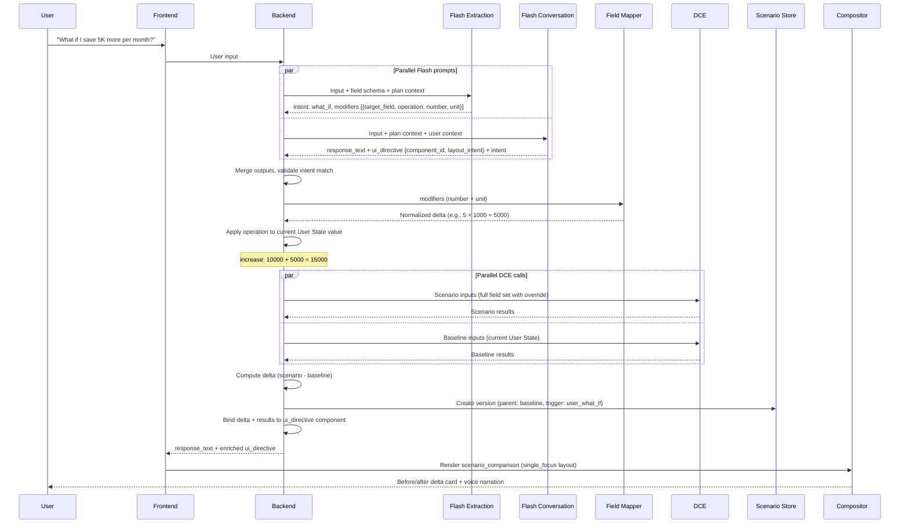
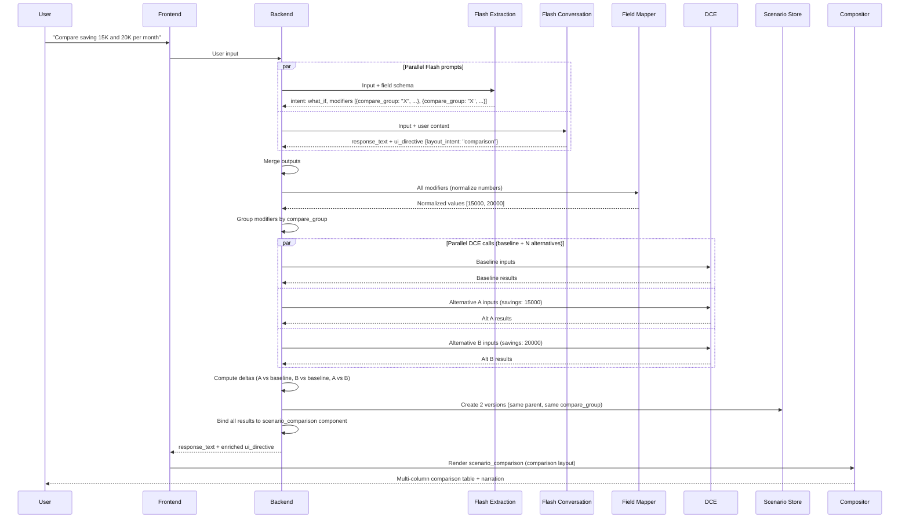
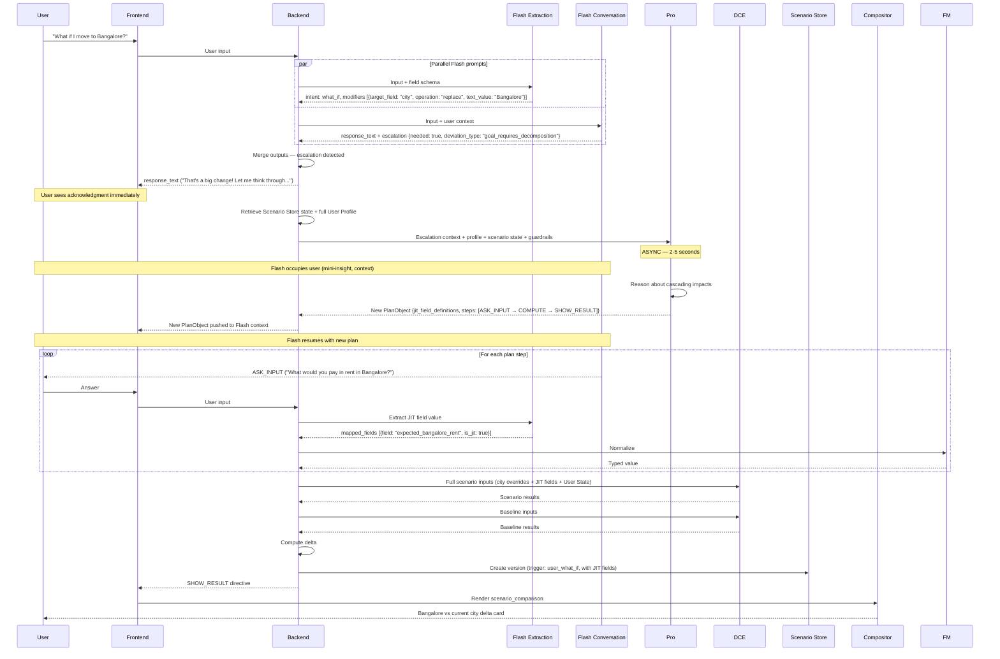
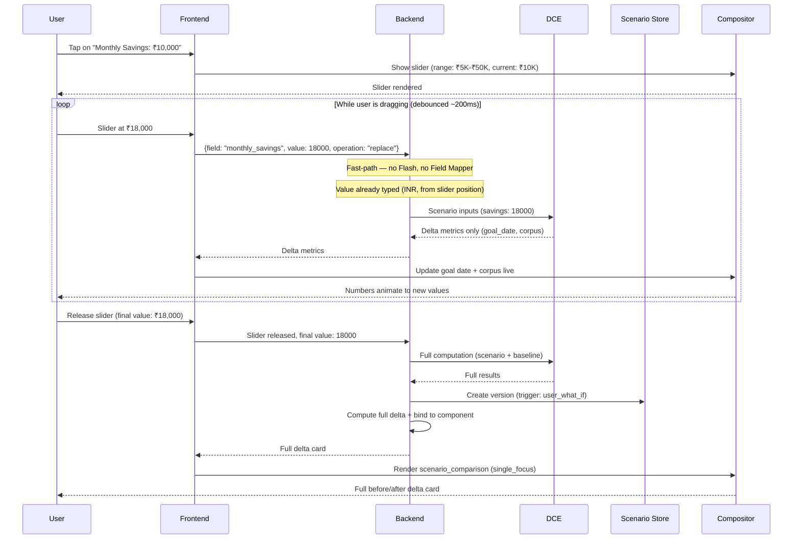
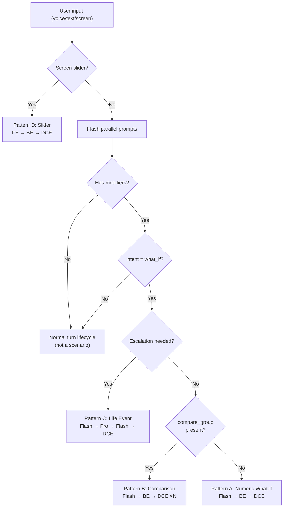

# Scenario System Design — Engineering Flows

> **Scope:** High-level engineering flows derived from [Scenario UX Design](file:///Users/kshekhaw/.gemini/antigravity/brain/e17a4252-6bfa-4fe9-aae7-b7f385c972b8/scenario_ux_design.md) product requirements.  
> **Companion to:** [System Entity Analysis](file:///Users/kshekhaw/Documents/CarrotFin_strategy/strategy/system_entity_analysis.md) (entity blueprint)  
> **Date:** 2026-05-18  
> **Status:** In progress — §1 complete

---

## §1 — Scenario Request Lifecycle

Four distinct lifecycle patterns exist for scenario requests. Each maps to different entity involvement, different data paths, and different user-perceived interaction speeds.

### Pattern Overview

| Pattern | Trigger | Entities Involved | Pro? | Typical Scenario Types |
|---|---|---|---|---|
| **A: Numeric What-If** | Voice/text with modifier | Flash → BE → DCE | No | Single-variable, multi-variable, removal |
| **B: Comparison** | Voice/text with `compare` | Flash → BE → DCE (parallel) | No | A vs B (up to 3 alternatives) |
| **C: Life Event** | Categorical modifier or multi-domain impact | Flash → BE → Pro → Flash → BE → DCE | Yes | City move, job change, new dependent |
| **D: Slider** | Screen interaction (tap + drag) | FE → BE → DCE | No | Single-variable numeric exploration |

---

### Pattern A: Numeric What-If

**Covers:** Single-variable, multi-variable (up to 3), removal scenarios. The most common pattern (~80% of scenario interactions).



**Key flow decisions:**
- **Baseline always computed fresh** alongside scenario — not cached from a prior turn. Baseline values may have changed between turns.
- **Multi-variable:** BE receives multiple modifiers in one turn. All applied to the same DCE call — not sequential. One scenario version created with all overrides.
- **Removal (`remove`):** Target field set to 0 in the scenario input set. DCE doesn't know the difference — it just receives a full input set.
- **The scenario version stores FULL inputs** — not just the delta. This enables independent re-computation and branching without dependency on parent version availability.

---

### Pattern B: Comparison What-If

**Covers:** "Compare X vs Y" scenarios. User wants side-by-side evaluation of 2-3 alternatives.



**Key flow decisions:**
- **`compare_group` is the linking mechanism.** Flash emits it; BE groups by it; Scenario Store versions share it. This is how the system knows "these belong together."
- **Baseline is ALWAYS included** as one column — even if the user only said "compare A and B." The baseline provides the anchor for delta annotations.
- **Max 3 alternatives** per comparison (constraint from UX — cognitive overload guardrail). BE validates this.
- **Parallel DCE calls** — baseline + all alternatives fire simultaneously. Each gets a complete input set. No dependency between alternatives.
- **Scenario Store:** Each alternative is a separate version, all branching from the same parent (baseline), all sharing the same `compare_group`. The `get_comparison(compare_group)` operation retrieves them together.

---

### Pattern C: Life Event Scenario (Pro Escalation)

**Covers:** Categorical what-ifs where Flash detects multi-domain cascading impact. City move, job change, new dependent, marriage, health condition.



**Key flow decisions:**
- **Escalation trigger is the conversation prompt** — it evaluates whether the categorical modifier requires multi-domain reasoning. The extraction prompt just maps the field + value; it doesn't decide on escalation.
- **Flash stays warm during Pro thinking.** This is "purposeful occupancy" — not dead time. Flash provides contextual micro-content while Pro reasons.
- **Pro defines JIT fields** for scenario-specific data points (e.g., `expected_bangalore_rent`) that don't exist in the core schema. These fields are scoped to this scenario — they don't persist.
- **The plan is multi-step.** Unlike Pattern A (single turn), Pattern C may require 2-3 turns of data collection before DCE can compute. Each turn follows the normal turn lifecycle from the System Entity Analysis.
- **Only after all plan steps complete** does DCE run the full scenario computation. The delta card is rendered only at the end.

---

### Pattern D: Slider Interaction (Screen-Initiated)

**Covers:** Visual numeric exploration via direct manipulation. No voice, no Flash, no extraction. The highest-engagement micro-interaction.



**Key flow decisions:**
- **Bypasses Flash entirely.** No extraction needed (field + value come from slider position). No conversation needed (visual-only interaction). This is the fastest path.
- **Bypasses Field Mapper.** Slider sends already-normalized values in INR — no number × unit decomposition needed.
- **Two-phase response:** (1) During drag: lightweight delta metrics only — fast, streaming, no Scenario Store write. (2) On release: full computation, full delta, Scenario Store version created.
- **Debouncing is FE-side.** BE receives ~5 calls/sec max during active sliding. Each call is independent (no session state between drag events).
- **Baseline is cached during slide session.** BE caches the baseline DCE result when the slider opens. During drag, only the scenario DCE call runs — halving the computation. Full baseline recompute happens only on release.
- **Voice rejoins on release** (if voice mode is active). Flash receives the final value and narrates the delta. If voice is inactive, the delta card alone is sufficient.

---

### Cross-Pattern Lifecycle Summary



**Routing logic lives in the BE merge step.** After merging the two Flash outputs, the BE evaluates:
1. `intent == what_if`? If no → normal turn.
2. `escalation.needed == true`? If yes → Pattern C.
3. Any modifier has `compare_group`? If yes → Pattern B.
4. Otherwise → Pattern A.

The slider (Pattern D) is the only path that doesn't go through Flash at all — it's detected at the FE level and sent directly to a dedicated BE endpoint.

---

### Scenario Store Version Creation — When and What

| Pattern | When version is created | What's stored |
|---|---|---|
| **A** | After DCE returns | Full inputs, full outputs, delta from parent |
| **B** | After all parallel DCE calls return | One version per alternative, all sharing `compare_group` |
| **C** | After final DCE call (post-plan completion) | Full inputs including JIT fields, outputs, delta |
| **D (drag)** | NOT created during drag | — |
| **D (release)** | After full DCE on final value | Full inputs, full outputs, delta from parent |

**In all patterns:** the version stores FULL inputs (not deltas). This is deliberate — it enables re-computation, independent branching, and comparison without needing to walk the version tree to reconstruct inputs.

---

### Scenario-to-Reality Conversion (All Patterns)

After any scenario result is displayed, the user may choose to "keep this" — converting the scenario into their real profile.

```
User: "Yes, let's go with the ₹15K plan"
  │
  ▼
BE:
  1. Read scenario version inputs from Scenario Store
  2. Identify changed fields (delta_from_parent.changed_inputs)
  3. Write changed fields to User State Store as data_input (same path as normal data collection)
  4. Mark scenario version status: "acted_upon"
  5. Flash confirms: "Done — I've updated your savings target to ₹15K."
```

This is intentionally the **same write path as normal data input** — the User State Store doesn't know or care whether a value came from a conversation or a scenario conversion. This keeps the persistence layer simple.

---

*§2 (Backend Orchestrator Logic), §3 (Scenario Store Data Model), §4-§6 to follow in subsequent sessions.*
