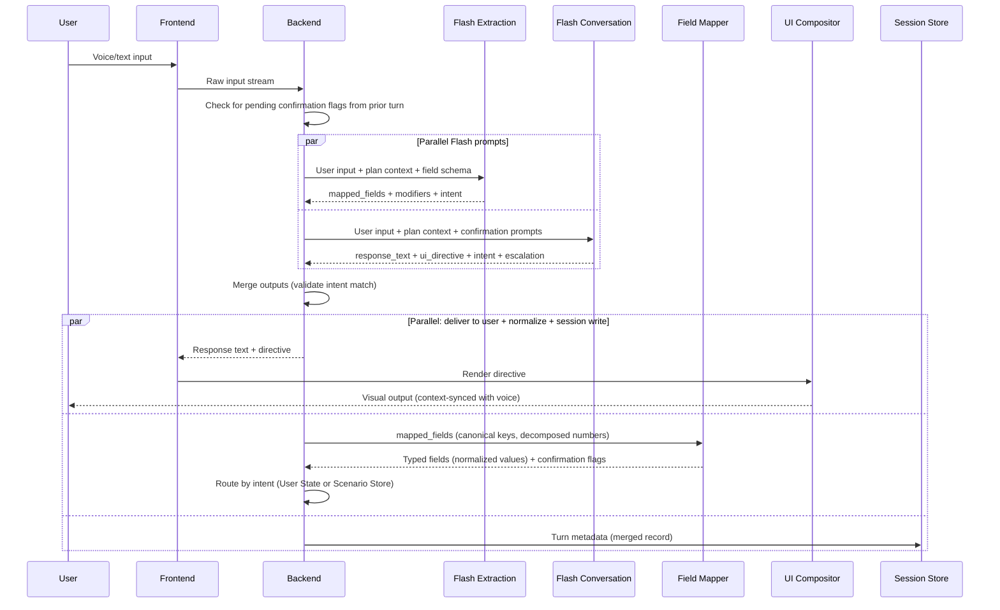
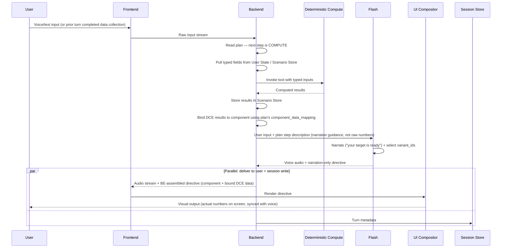
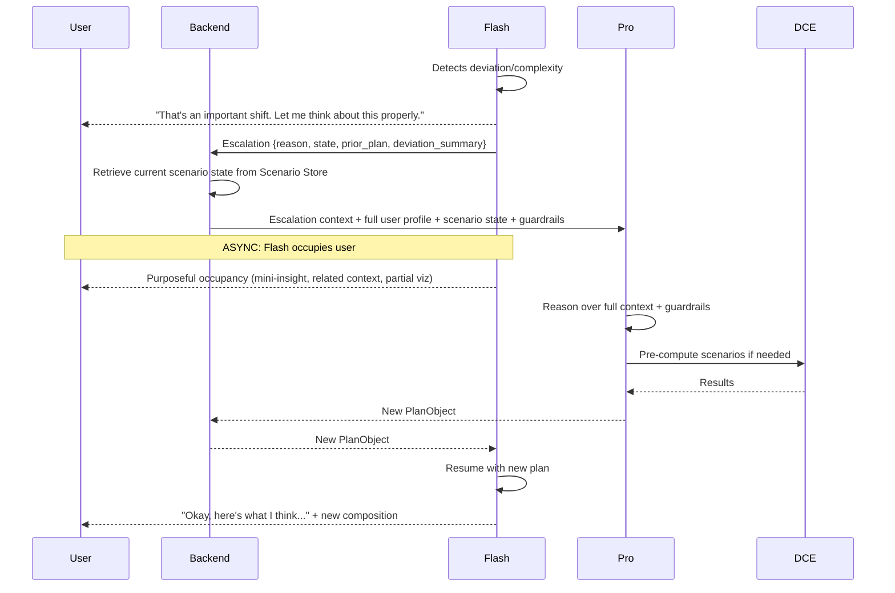

# System Entity Analysis: "Pro Plans JIT, Flash Executes, Tools Compute"

> **Goal:** Extend Approach 1 from brainstorming notes into a complete entity blueprint that can later drive architecture design.  
> **Scope:** Define *what* each entity is, *what it does*, *what it needs*, and *how entities coordinate*. NOT a detailed architecture doc — a principled entity map.  
> **Date:** 2026-05-08 | **Last reconciled:** 2026-05-18 (Flash schema-aware + parallel prompts + scenario scoping)

---

## The Core Thesis Restated

The system has three tiers of intelligence, each optimized for a different job:

| Tier | Entity | Optimised For | Latency Profile |
|------|--------|--------------|-----------------|
| **Reasoning** | Pro Model (Gemini Pro) | Planning, decomposition, high-stakes judgment | Tolerant (async where possible) |
| **Execution** | Flash Live (Gemini Flash) | Conversational turns, voice output, plan execution | Ultra-low (~200-400ms target) |
| **Computation** | Deterministic Tools | Math, formulas, unit conversion, projections | Near-zero (in-process) |

**The fundamental contract:** Pro thinks. Flash talks. Tools compute. No entity does another's job.

---

## The 7 System Entities

### Entity 1: Flash Live (Voice + Conversation Engine)

**What it is:** The real-time conversational model that owns the user-facing interaction — both voice output and conversational text. It is the *only* entity the user directly perceives.

**Responsibilities:**
- Run as **two parallel prompts per turn** [as of 2026-05-14]:
  - **Extraction prompt** ([flash_extraction_v1.yaml](file:///Users/kshekhaw/Documents/CarrotFin_strategy/strategy/buildspecs/flash_extraction_v1.yaml)): Schema-aware field mapping — maps user utterances directly to canonical field keys (`mapped_fields`), resolves what-if modifications to semantic operations (`modifiers`: `increase`, `decrease`, `replace`, `remove`, `increase_percent`, `decrease_percent`, `compare`), classifies `intent`
  - **Conversation prompt** ([flash_conversation_v1.yaml](file:///Users/kshekhaw/Documents/CarrotFin_strategy/strategy/buildspecs/flash_conversation_v1.yaml)): Generates response text, UI composition directives (component selection + layout), and escalation signals
- Execute the current plan turn-by-turn (asking for inputs, explaining, narrating)
- Generate voice audio output with appropriate tone, pacing, emotion
- Decide voice-vs-screen allocation per turn (Core Principle 2: Voice + Screen Optimised Together)
- Emit UI composition instructions to the UI Compositor (not raw UI — structured directives)
- For JIT fields: attach the relevant `jit_field_definition` from the plan to the extraction (LLM reasoning maps user utterance → correct JIT definition)
- Emit a per-turn `intent` signal (`data_input | what_if | correction | question | goal_change | greeting | acknowledgment`) for BE routing — both prompts emit intent independently; BE validates match
- Select adaptive `variant_id` for components at directive emission time, using user context snapshot
- Detect deviations from the current plan (goal change, contradiction, emotional shift, new constraint)
- Route escalations to Pro with structured context (conversation prompt owns the escalation signal)

**What it does NOT do:**
- ❌ Multi-step financial reasoning or plan creation
- ❌ Invoke DCE or receive DCE results — BE orchestrates computation and binds results directly to UI components; Flash narrates from plan step descriptions, not raw numbers
- ❌ Multiply number × unit (Field Mapper handles normalization — Flash extracts number and scale word separately, e.g., "1.2" + "lakh" not "120000")
- ❌ Make high-consequence recommendations without Pro approval

**Required Inputs (per turn — shared context for both parallel prompts):**
| Input | Source | Used By | Purpose |
|-------|--------|---------|--------|
| Current plan object | Pro Model (via Plan Store) | Both | What to execute this turn; extraction uses `jit_field_definitions` |
| User's voice/text input | Frontend client via BE | Both | What the user said/typed |
| Canonical field schema | Baked into extraction prompt | Extraction | Schema-aware mapping targets (15 core fields + JIT) |
| Collected fields summary | User State Store (via BE) | Extraction | Prevents re-extracting known fields; resolves references |
| User context snapshot | User State Store | Conversation | Emotional state, literacy level, trust level, history |
| Conversation history (windowed) | Session Store | Both | Structured turn records, last 10 turns |
| Financial knowledge base (lightweight) | Guardrails Layer + curated KB | Conversation | Basic financial concepts + guardrail boundaries |
| Narration guidance (if COMPUTE step) | BE | Conversation | Plan step description — Flash narrates intent, not raw numbers |
| Pending confirmation prompts (if any) | BE (via Field Mapper flags) | Conversation | BE injects confirmation asks for ambiguous extractions |

**Outputs (two parallel streams, merged by BE):**

*From extraction prompt:*
| Output | Destination | Format |
|--------|-------------|--------|
| Mapped fields | Field Mapper (via BE) | `[{field, number, unit, period, qualifier, raw_span, text_value, is_jit, relationship, confidence}]` |
| Unmapped fields | BE (disposition) | Same schema, best-guess keys |
| Modifiers | BE (scenario engine) | `[{target_field, operation, number, unit, period, text_value, raw_span, compare_group}]` |
| Intent | BE | `data_input \| what_if \| correction \| question \| goal_change \| greeting \| acknowledgment` |

*From conversation prompt:*
| Output | Destination | Format |
|--------|-------------|--------|
| Response text | Frontend (via BE) | Conversational text (streaming for voice) |
| UI directive | UI Compositor (via BE) | `{components: [{component_id, data, priority}], layout_intent, transition}` |
| Intent | BE | Same enum — BE validates match |
| Escalation | Pro Model (via BE) | `{needed, reason, deviation_type}` |

*Combined (post-merge by BE):*
| Output | Destination | Format |
|--------|-------------|--------|
| Turn metadata | Session Store | Merged record: input, response, extractions, directive, intent |

**Latency Budget:** ≤400ms to first audio byte. This is the hardest constraint in the system. Everything Flash receives must be pre-digested; it cannot afford to reason deeply or wait for slow upstream calls. Flash must be kept lean — all inputs are pre-digested compressed forms (see table above).

> **Maps to Core Principles:** P2 (Voice + Screen), P5 (Speed Is Trust), P6 (Read the Room)

---

### Entity 2: Pro Model (Strategic Reasoning Engine)

**What it is:** The high-reasoning model invoked JIT when Flash cannot proceed alone. Pro is the *planner* — it decomposes user goals into executable steps, selects the right tools/formulas, and makes high-stakes judgment calls.

**Responsibilities:**
- Decompose user goals into structured plan objects
- Select appropriate formula/tool chains for financial computations
- Make high-consequence recommendations (with reasoning trail)
- Re-plan when Flash reports a deviation
- Resolve ambiguity that can't be handled by a clarifying question

**Invocation Policy (Escalation from Flash):**

Flash is the default for every turn. Escalate to Pro **only** when:

| Trigger | Example | Sync/Async |
|---------|---------|------------|
| Multi-step decomposition needed | "Help me plan for both a house and my kid's education" | Async (Flash occupies user) |
| High-consequence recommendation | "Should I break my FD to invest in stocks?" | **Sync** (user is waiting for advice) |
| Problem reframing (not slot-filling) | "Actually, forget retirement — I might start a business" | Async (Flash acknowledges + occupies) |
| Unresolvable ambiguity | User's inputs contradict each other in ways a clarifying Q can't fix | Async |

**Pro's Output Contract — The Plan Object:**

Pro must **always** emit a structured plan, never prose. This is non-negotiable — Flash cannot interpret freeform guidance reliably under latency pressure.

```
PlanObject {
  plan_id: string
  goal: string                          // "Build emergency fund of 6 months expenses"
  success_condition: string             // "User has a savings target set and first SIP configured"
  
  // --- JIT Field Definitions (Two-Tier Schema) ---
  // Core fields (income, expenses, age, etc.) are pre-defined in the system schema.
  // When Pro needs a field that doesn't exist in core schema, it defines it here.
  // Field Mapper uses these definitions to parse/type the JIT field.
  // JIT fields are scoped to this plan/scenario — not promoted to core schema automatically.
  jit_field_definitions: [
    {
      field_name: string               // "business_startup_capital"
      type: enum(CURRENCY | PERCENTAGE | DURATION | NUMBER | BOOLEAN | CHOICE)
      unit_contract: string            // "INR, one_time"
      parsing_hint: string             // "Indian currency, likely lakhs/crores" — helps Field Mapper
      validation: object               // min/max/allowed values
      scope: enum(PLAN | SCENARIO)     // PLAN = dies with plan; SCENARIO = persists in scenario store
    }
  ]
  
  steps: [
    {
      step_id: string
      action: enum(ASK_INPUT | COMPUTE | SHOW_RESULT | RECOMMEND | CONFIRM_ACTION)
      description: string               // Flash-readable instruction
      
      // For ASK_INPUT steps
      required_inputs: [
        {
          field_name: string             // "monthly_expenses" (core) or "business_startup_capital" (JIT)
          is_jit: boolean                // true if defined in jit_field_definitions above
          type: enum(CURRENCY | PERCENTAGE | DURATION | NUMBER | BOOLEAN | CHOICE)
          unit_contract: string          // "INR, monthly"
          why_needed: string             // Flash reads this to user: "I need this because..."
          validation: object             // min/max/allowed values
        }
      ]
      
      // For COMPUTE steps  
      tool_chain: [
        {
          tool: string                   // "emergency_fund_calculator"
          inputs_from: [string]          // references to prior step outputs
          output_key: string
        }
      ]
      
      // For SHOW_RESULT steps
      component_id: string               // Concrete ID from Component Registry: "sip_projection_chart_v1"
      component_data_mapping: object     // Maps computed outputs to the component's input schema
      
      // For RECOMMEND steps
      recommendation: object             // Pre-computed or to-be-computed
      consequence_level: enum(LOW | MEDIUM | HIGH)
      guardrail_refs: [string]           // Which guardrails apply
    }
  ]
  
  deviation_handlers: {
    goal_change: string                  // instruction for Flash on what to do
    contradiction: string
    emotional_shift: string
    new_constraint: string
  }
}
```

**What Pro does NOT do:**
- ❌ Talk to the user (ever — Flash is the only voice)
- ❌ Execute plans step-by-step (Flash does this)
- ❌ Run financial calculations directly (delegates to Deterministic Compute via the plan)

**Required Inputs:**
| Input | Source | Purpose |
|-------|--------|---------|
| Escalation context from Flash | Flash Live | Current state, what went wrong, partial progress |
| Full user profile | User State Store | Complete financial picture for reasoning |
| Current scenario state | Scenario Store | Active scenario with collected inputs, computed outputs, and version tree — so Pro doesn't re-ask collected data |
| Financial principles document | Guardrails Layer | Ground reasoning in sound financial advice |
| Available tool/formula registry | Deterministic Compute Engine | What computation capabilities exist |
| Component Registry | Server-side registry | Component IDs, input schemas, and capabilities — Pro selects specific component IDs for SHOW_RESULT steps |
| Core field schema | Backend | Pre-defined field list — Pro checks before defining JIT fields |

**Latency Profile:** 2-10 seconds typical. Acceptable because:
1. Most Pro calls are async (Flash occupies the user meanwhile)
2. For sync calls (high-consequence), the user expects thoughtfulness — a 3-second pause before serious financial advice is *more* trustworthy than an instant response

> **Maps to Core Principles:** P1 (Context Over Convention), P3 (Structured Thinking), P4 (Firm on Principles)

---

### Entity 3: Deterministic Compute Engine (DCE)

**What it is:** A library/service of pure, auditable financial computation functions. No LLM, no probabilistic reasoning. Given typed inputs, produces exact outputs. Every result is reproducible.

**Responsibilities:**
- Execute financial formulas: compound interest, SIP projections, EMI, tax calculations, goal-gap analysis, emergency fund sizing, insurance need estimation
- Scenario computation: given parameters, compute projection with sensitivity ranges
- What-if deltas: "If you increase SIP by ₹2K, here's the difference"

**Why NOT an LLM:** determinism (same inputs → same outputs), reproducibility (auditability requires exact math), speed (microseconds vs. hundreds of ms).

**Interface:**
```
// Every tool has a typed contract
Tool {
  name: string
  description: string                    // Pro reads this to select the right tool
  input_schema: {                        // Typed, validated inputs
    [field]: { type, unit, period, validation }
  }
  output_schema: {                       // Typed outputs
    [field]: { type, unit, period }
  }
  compute(inputs) → outputs             // Pure function, no side effects
}
```

**Tool Registry (MVP — illustrative, not exhaustive):**

| Tool | Inputs | Outputs |
|------|--------|---------|
| `emergency_fund_calculator` | monthly_expenses, risk_factor | target_amount, range_low, range_high |
| `sip_projector` | monthly_amount, duration_months, expected_return_pct | future_value, total_invested, total_returns |
| `goal_gap_analyzer` | target_amount, target_date, current_savings, monthly_contribution, expected_return | gap_amount, required_monthly_increase, on_track_probability |
| `emi_calculator` | principal, interest_rate, tenure_months | emi_amount, total_interest, total_payment |
| `tax_optimizer_80c` | current_80c_used, income_bracket | remaining_limit, tax_saving_potential, suggested_instruments |

**What DCE does NOT do:**
- ❌ Decide *which* calculation to run (Pro does this)
- ❌ Interpret or parse natural language (Field Mapper does this)
- ❌ Normalize units from raw text (Field Mapper does this — DCE receives already-typed inputs)
- ❌ Explain results to the user (Flash does this)

> **Maps to Core Principles:** P5 (Speed Is Trust — instant computation), P4 (Firm on Principles — deterministic = no bad math)

---

### Entity 4: Input Pipeline (Flash Extracts + Maps → Field Mapper Normalizes)

**What it is:** A pipeline that bridges fuzzy human speech to deterministic system state. Flash's extraction prompt maps user utterances directly to canonical fields and resolves modifier operations. The Field Mapper — a lightweight, deterministic backend step — handles only number normalization (multiply number × unit).

**Architecture evolution [as of 2026-05-14]:**
- **Previous:** Two-stage pipeline where Flash was schema-unaware. Flash extracted raw values; Field Mapper did schema mapping, modifier resolution, AND number normalization.
- **Current:** Flash is **schema-aware** via the Gemini Structured Output API. The extraction prompt maps directly to canonical field keys and resolves modifiers to semantic operations (`increase`, `decrease`, `replace`, `remove`, `increase_percent`, `decrease_percent`, `compare`). Field Mapper's role is reduced to **number normalization only**.
- **Why the shift:** Gemini 3.1's structured output made schema-aware extraction reliable without latency penalty (~15 canonical fields is lightweight context). Collapsing extraction + mapping into one LLM pass eliminates an entire error surface (schema-agnostic keys like "income" vs "salary" mismatching canonical "monthly_income").

**The core accuracy rule is preserved:** Flash extracts the base number and scale word separately — it does NOT multiply. `"1.2" + "lakh"` not `"120000"`. This eliminates catastrophic 10×–1000× errors on Indian numeric expressions. The multiplication happens deterministically in Field Mapper.

**Stage 1 — Flash Extraction Prompt (schema-aware, parallel with conversation prompt):**

Flash's extraction prompt outputs structured JSON with three arrays — see [flash_extraction_v1.yaml](file:///Users/kshekhaw/Documents/CarrotFin_strategy/strategy/buildspecs/flash_extraction_v1.yaml) for the full schema:

```
// Flash extraction output — schema-aware, canonical field keys
{
  intent: "data_input",
  mapped_fields: [
    // Mapped to canonical field key directly by Flash
    { field: "monthly_income", raw_span: "about 1.2 lakhs per month",
      number: "1.2", unit: "lakh", period: "month",
      qualifier: "approximate", text_value: null,
      is_jit: false, relationship: null, confidence: "high" },
    { field: "monthly_expenses", raw_span: "around 70 to 80 thousand",
      number: "70-80", unit: "thousand", period: "month",
      qualifier: "range", text_value: null,
      is_jit: false, relationship: null, confidence: "high" }
  ],
  unmapped_fields: [
    // Data Flash couldn't map to any canonical or JIT field
    { field: "side_hustle_revenue", raw_span: "I also make about 20K from freelancing",
      number: "20", unit: "thousand", period: "month",
      qualifier: "approximate", text_value: null,
      is_jit: false, relationship: null, confidence: "medium" }
  ],
  modifiers: [
    // What-if scenario — operation already resolved by Flash
    // { target_field: "monthly_savings", operation: "increase",
    //   number: "5", unit: "thousand", period: "month",
    //   text_value: null, raw_span: "save 5K more per month",
    //   compare_group: null }
  ]
}
```

**Extraction schema (per field/modifier):**
| Field | Type | Purpose |
|-------|------|---------|
| `field` / `target_field` | string | **Canonical field key** (e.g., `monthly_income`) — Flash maps directly |
| `raw_span` | string | Exact user phrase — audit trail and fallback |
| `number` | string \| null | Numeric core as TEXT, not multiplied: "1.2" not "120000" |
| `unit` | string \| null | Scale word as spoken: lakh, thousand, K, crore, hazaar |
| `period` | string \| null | Temporal basis: month, year, week, day, one_time |
| `qualifier` | string \| null | approximate, range, exact |
| `text_value` | string \| null | For non-numeric fields: city names, choices, categorical values |
| `operation` | string \| null | *(modifiers only)* Semantic operation: increase, decrease, replace, remove, increase_percent, decrease_percent, compare |
| `compare_group` | string \| null | *(modifiers only)* Links alternatives in a comparison set |
| `is_jit` | boolean | True if from plan's `jit_field_definitions`, not core schema |
| `relationship` | string \| null | Who this belongs to: self, spouse, parent, child |
| `confidence` | string | Flash's mapping confidence: high, medium, low |

**Stage 2 — Field Mapper (number normalization only, backend):**

A lightweight, deterministic step that receives Flash's `mapped_fields` (already keyed to canonical fields) and performs only:
1. **Number normalization:** multiply number × unit multiplier (e.g., 1.2 × 100000 = 120000)
2. **Range handling:** for qualifier "range", compute low/high/midpoint
3. **Period defaulting:** apply defaults when period is null (income→monthly, CTC→annual)
4. **Ambiguity flagging:** flag `requires_confirmation` for ranges and low-confidence mappings

```
// Field Mapper output — typed, normalized values
{
  typed_fields: [
    { field: "monthly_income", value: 120000, currency: "INR", period: "MONTHLY",
      qualifier: "approximate" },
    { field: "monthly_expenses", value: 75000, currency: "INR", period: "MONTHLY",
      qualifier: "range", ambiguity: { low: 70000, high: 80000, interpretation: "midpoint" } }
  ],
  requires_confirmation: ["monthly_expenses"],
  unmappable: []
}
```

**What Field Mapper does NOT do (any more):**
- ~~Schema mapping~~ — Flash does this directly
- ~~Modifier resolution~~ — Flash resolves to semantic operations
- ~~Intent routing~~ — BE reads intent from Flash's output directly

**Field Mapper implementation (MVP):** Rule-based. Unit multiplier lookup table (~25 entries: lakh→100000, crore→10000000, hazaar→1000, K→1000). Period defaults table (~20 rules). For JIT fields, Field Mapper uses the `is_jit` flag and the plan's `jit_field_definitions` for type contracts. Not an LLM — must be deterministic and auditable.

**Routing by intent:** The BE uses Flash's `intent` signal to route:
- `data_input` / `correction` → **persist** typed fields to User State Store
- `what_if` → **transient** to Scenario Store as a new version (DB unchanged)
- `question` / `goal_change` → no field persistence, route to Flash or Pro as appropriate

**Confirmation loop:** When Field Mapper flags `requires_confirmation`, the BE stores these flags. On the next turn, the BE dynamically injects a structured confirmation prompt into Flash's conversation prompt context. Flash reads this and asks the user naturally.

> **Maps to Core Principles:** P5 (Speed — normalization is ~10ms post-processing), P7 (Earn the Right — parse only what's been volunteered)

---

### Entity 5: Scenario Store (Versioned Computation State)

**What it is:** A persistent, versioned store for user scenarios and what-if explorations. Not a database of facts — a workspace where the AI and user collaborate on financial plans that evolve.

**Why versioning matters:**
- User says "What if I increase my SIP by 5K?" → new scenario version, old one preserved
- User says "Actually go back to the original" → instant revert
- User says "Compare both options" → both versions available for side-by-side
- Advisor says "Here's what changed since last time" → diff between versions

**Data Model:**
```
Scenario {
  scenario_id: string
  user_id: string
  goal_id: string                        // Per-goal scoping — each goal has its own scenario tree
  goal: string                           // "Emergency fund" | "Retirement planning"
  created_at: timestamp
  
  // JIT fields that Pro defined for this scenario (not in core schema)
  jit_fields: [
    {
      field_name: string                 // "business_startup_capital"
      type_contract: { type, unit, period, validation }  // From Pro's jit_field_definitions
      created_by_plan: string            // plan_id that introduced this field
    }
  ]
  
  versions: [
    {
      version_id: string
      parent_version_id: string | null   // enables tree, not just linear history
      created_at: timestamp
      trigger: string                    // "user_what_if" | "ai_suggestion" | "data_update" | "compare"
      compare_group: string | null       // Links versions created by a comparison request
      status: string                     // "active" | "inactive" | "acted_upon" | "expired"
      
      inputs: { [field]: TypedValue }    // FULL inputs — Core + JIT fields, all typed
      outputs: { [field]: TypedValue }   // All computed results
      delta_from_parent: {               // What changed
        changed_inputs: [string],
        impact_summary: string           // "Increasing SIP by ₹5K improves corpus by ₹18L"
      }
    }
  ]
  
  active_version_id: string              // Which version is "current"
}
```

**Key operations:**
- `create_version(parent_id, trigger, modified_inputs)` → branch from parent with full inputs
- `revert_to(version_id)` → set `active_version_id` (no data deleted)
- `convert_to_reality(version_id)` → copy scenario inputs to User State Store, mark `acted_upon`
- `get_comparison(compare_group)` → return all versions sharing a `compare_group`

**Interactions with other entities:**
- **Pro** creates scenarios when decomposing goals; may define JIT fields scoped to the scenario
- **Flash** navigates between versions during conversation ("let me show you both options")
- **DCE** computes each version's outputs
- **UI Compositor** renders comparisons and deltas
- **BE** owns all Scenario Store operations — no other entity writes directly

> **Maps to Core Principles:** P3 (Structured Thinking — scenarios ARE structured thinking), P1 (Context Over Convention — scenarios are living, not template-bound)

---

### Entity 6: UI Compositor (Adaptive Interface Assembler)

**What it is:** The frontend entity that receives composition directives and renders them using the component palette. It does zero component *selection* logic — it receives a concrete `component_id`, looks up the corresponding widget, binds the data, and renders.

**Critical distinction — who decides what to show:**

The component selection chain is: **Pro selects → Flash emits → Compositor renders.**

- **Pro** (at plan time) has access to the **Component Registry** — a server-side catalog of all available components, their IDs, input schemas, and capabilities. Pro selects specific component IDs for SHOW_RESULT steps in the plan.
- **Flash** (at execution time) emits the component ID + bound data in its composition directive. Flash knows component IDs from the plan; it doesn't reason about which component to use.
- **Compositor** (frontend) receives `component_id: "sip_projection_chart_v1"`, looks it up in its local widget registry, binds the data, and renders. No intelligence, no selection, no ambiguity.

**The Component Registry (server-side):**
```
ComponentRegistryEntry {
  component_id: string                   // "sip_projection_chart_v1"
  display_name: string                   // "SIP Projection Chart" — human-readable, for Pro's context
  category: string                       // "charts" | "cards" | "forms" | "comparisons"
  input_schema: {                        // What data this component needs
    [field]: { type, required, description }
  }
  adaptive_variants: [                   // Literacy-level or density variants
    { variant_id: string, condition: string, description: string }
  ]
  capabilities: [string]                 // "comparison", "time_series", "single_metric", etc.
}
```

Pro reads this registry to make informed component selections. The registry is the **single source of truth** for what the frontend can render.

**Compositor Responsibilities (frontend only):**
- Receive composition directives with concrete component IDs and pre-selected variant IDs
- Look up widget by `component_id` in client-side widget map
- Bind data from the directive to the component's input schema
- Apply the `variant_id` specified in the directive (Flash selects the variant at emission time using user context; Compositor just renders it)
- Handle layout, transitions, and animations
- Keep voice and screen in context-level sync (screen shows what audio is discussing within a turn)

**Directive Format (from Flash to Compositor):**
```
CompositionDirective {
  surface_type: enum(STREAM | COMPOSED | AMBIENT)
  
  components: [
    {
      component_id: string               // Concrete ID: "sip_projection_chart_v1" — NOT a description
      variant_id: string                 // Flash pre-selects: "headline_only" | "full_detail" etc.
      data: object                       // Bound data matching the component's input_schema
      priority: number                   // For adaptive density management
      turn_context: string | null        // What this component relates to in the conversation
    }
  ]
  
  layout_hint: enum(STACK | COMPARISON | SINGLE_FOCUS)
  transition: enum(APPEND | REPLACE | SLIDE_IN)
}
```

**What Compositor does NOT do:**
- ❌ Choose which component to use (Pro already decided — Compositor gets an ID)
- ❌ Select adaptive variants (Flash already decided — Compositor gets a variant_id)
- ❌ Interpret natural language descriptions of components
- ❌ Access the Component Registry at runtime (it has a build-time widget map; registry is server-side for Pro)

> **Maps to Core Principles:** P1 (Context Over Convention — adaptive assembly via variants), P2 (Voice + Screen — context-level sync)

---

### Entity 7: Financial Guardrails Layer

**What it is:** A curated knowledge layer containing core financial principles, regulatory constraints, and safety boundaries that ground LLM reasoning. Not an entity that "runs" — a reference layer that other entities consume.

**Responsibilities:**
- Provide Pro with financial reasoning principles during planning
- Provide Flash with boundary rules during execution (what it must not advise)
- Flag when a user's stated intent violates a core principle (for P4: Firm on Principles)

**Structure:**
```
GuardrailSet {
  principles: [
    {
      id: string                         // "G-EF-001"
      category: string                   // "emergency_fund"
      rule: string                       // "Never recommend depleting emergency fund for investment"
      severity: enum(HARD | SOFT)        // HARD = block; SOFT = warn + explain
      explanation_template: string       // Why this matters, in user-friendly language
      applicable_contexts: [string]      // When this guardrail activates
    }
  ]
}
```

**Delivery mechanism:**
- **To Pro:** Full relevant guardrail set included in prompt context during planning. Pro references guardrail IDs in plan steps.
- **To Flash:** Compressed subset — only guardrails relevant to the current plan/topic. Delivered as part of the plan object's `guardrail_refs`. (MVP: direct prompt inclusion — corpus too small for RAG.)

> **Maps to Core Principles:** P4 (Firm on Principles, Empathetic in Delivery)

---

## How Entities Coordinate: The Turn Lifecycle

### Normal Turn — Data Collection (ASK_INPUT step)



### Normal Turn — Computation (COMPUTE + SHOW_RESULT steps)



> **Key design decision:** Flash does not see DCE results. The BE binds computed values (e.g., ₹3,50,000 target) directly into the component data using `component_data_mapping` from the plan. Flash narrates intent ("your emergency fund target is ready — take a look") from the plan step description. The actual numbers appear on screen via the Compositor. This keeps Flash lean and avoids loading it with numeric data it doesn't need.

### Escalation Turn (Flash → Pro)



---

## Latency Budget Breakdown

Total budget for a normal turn: **≤800ms** (first audio byte + first visual update)

| Phase | Entity | Budget | Notes |
|-------|--------|--------|-------|
| Network (user → BE) | Infra | ~50ms | WebSocket, already connected |
| DCE (if COMPUTE step) | BE + DCE | ~10ms | BE reads plan, pulls typed fields, calls DCE. Only on computation turns. |
| Flash inference | Flash Live | ~300ms | Streaming — first token matters. For COMPUTE turns, receives narration guidance (no DCE data). |
| Network (BE → FE) | Infra | ~50ms | Streaming audio + directive |
| UI render | Compositor | ~50ms | Component from palette, variant pre-selected |
| **Buffer** | — | ~340ms | For variance, retries, edge cases |
| Field Mapper | Mapper | ~10ms | **Off critical path** — runs in parallel after Flash responds. Does not block audio/visual. |

**For escalation turns (async):**
- Pro inference: 2-10 seconds
- Flash occupancy fills this gap — user never waits in silence

---

## Entity-to-Principle Mapping

| Principle | Primary Entity | Supporting Entities |
|-----------|---------------|-------------------|
| P1: Context Over Convention | Pro (plans contextually) | Flash (executes contextually), Compositor (renders contextually) |
| P2: Voice + Screen Optimised | Flash (decides allocation) | Compositor (syncs visual to voice) |
| P3: Structured Thinking | Pro (decomposes into plans) | Scenario Store (versions the thinking), Flash (walks user through structure) |
| P4: Firm on Principles | Guardrails Layer (defines rules) | Pro (reasons against them), Flash (delivers empathetically) |
| P5: Speed Is Trust | Flash (low latency) | Field Mapper (off critical path), DCE (instant compute), Compositor (fast render) |
| P6: Read the Room | Flash (tone/pacing calibration) | Pro (emotional shift triggers re-plan) |
| P7: Earn the Right to Know | Flash (asks with justification) | Pro (plans progressive data collection) |

---

## Open Questions for Founder Review

### Resolved Decisions

| # | Question | Decision | Rationale |
|---|----------|----------|----------|
| Q1 | Where does User State Store live? | **Backend infrastructure**, not a separate intelligent entity | It stores and retrieves; it doesn't reason. Schema needs careful design since every other entity depends on it. |
| Q2 | Session Store vs. Scenario Store | **Two separate stores** with different lifecycles | Session Store is ephemeral (conversation turns, lives for a session). Scenario Store is persistent (versioned financial plans, lives across sessions). Different data, different retention. |
| Q3 | Input parsing architecture | **Flash schema-aware + Field Mapper normalizes** [updated 2026-05-14] | Previous: two-stage, Flash schema-unaware. Current: Flash maps to canonical fields directly via Structured Output API. Field Mapper reduced to number normalization. Shift driven by Gemini 3.1's structured output reliability and elimination of schema-agnostic key mismatch errors. |
| Q4 | Voice-Visual sync precision | **Context-level sync**, not millisecond precision | Within a single turn, screen must show what audio is discussing. Does not require real-time audio-position alignment. |
| Q5 | Pro's Purposeful Occupancy | **Deferred to design phase** | Directionally: contextual occupancy — partial visualisations, secondary questions that feed the plan. Not filler. |
| Q6 | Who orchestrates DCE? | **BE orchestrates DCE**, not Flash | BE reads the plan, pulls typed fields from store, calls DCE, binds results to components. Flash never calls or receives from DCE. |
| Q8 | How does Field Mapper handle JIT fields? | **Flash marks `is_jit: true`**; Field Mapper uses plan's `jit_field_definitions` | Flash's LLM reasoning maps user utterances to the correct JIT definition. Field Mapper uses type contract for normalization. |
| Q9 | Who selects adaptive variant? | **Flash selects variant_id** at directive emission time | Flash has user context snapshot and evaluates variant conditions. Compositor is a pure renderer. |
| Q10 | How do confirmation flags reach Flash? | **BE injects dynamically** into conversation prompt context | Field Mapper flags ambiguous extractions. BE stores flags and injects into next turn. |
| Q11 | Does Pro know what's been collected? | **Yes — BE passes Scenario Store state** during escalation | BE retrieves current scenario (inputs, outputs, version tree) and includes in Pro's context. |
| Q12 | Session Store write in diagrams | **Added** to parallel block | Turn metadata written in parallel with audio delivery and Field Mapper. |
| Q13 | Parallel vs. single Flash prompt | **Two parallel prompts** (extraction + conversation) [2026-05-14] | Separation of concerns: extraction is structured data output (JSON schema enforced), conversation is natural language + UI directives. Different `thinking_level` configs possible. BE merges outputs. |
| Q14 | Scenario scoping | **Per-goal** — each journey/goal has its own scenario tree [2026-05-18] | No cross-goal scenario linking in MVP. Keeps version trees manageable. |

---

## What This Analysis Does NOT Cover (Deferred to Architecture Phase)

1. **Infrastructure:** How entities are deployed (microservices, monolith, serverless)
2. **Data persistence:** Database choices, caching strategies
3. **Auth & security:** How user financial data is protected
4. **Monitoring & observability:** How we know the system is healthy
5. **Component palette definition:** The actual UI components available
6. **Guardrails content:** The actual financial principles (separate workstream)
7. **Error handling:** What happens when entities fail
8. **Multi-turn memory:** How conversation history is managed across sessions

---

*This analysis is a companion to [core-app-principles.md](file:///Users/kshekhaw/Documents/CarrotFin_strategy/knowledge-base/core-app-principles.md) and extends the brainstorming notes in [Brainstorming notes for system entity ideation.md](file:///Users/kshekhaw/Documents/CarrotFin_strategy/workspace-files/Brainstorming%20notes%20for%20system%20entity%20ideation.md).*
